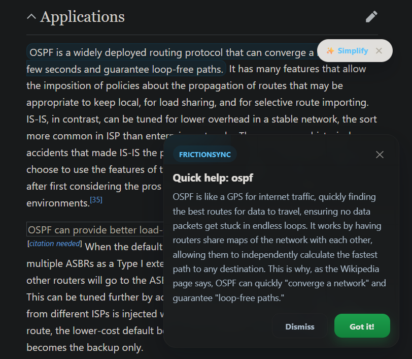
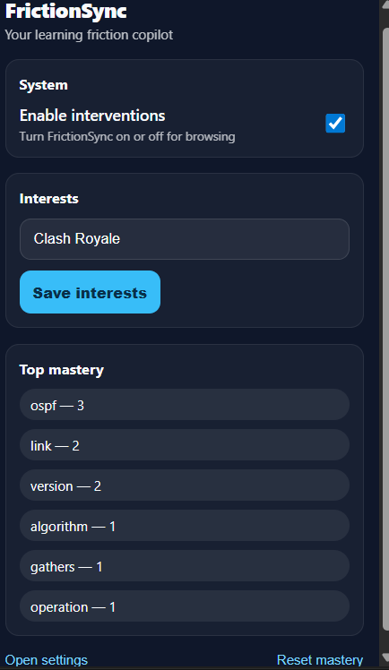
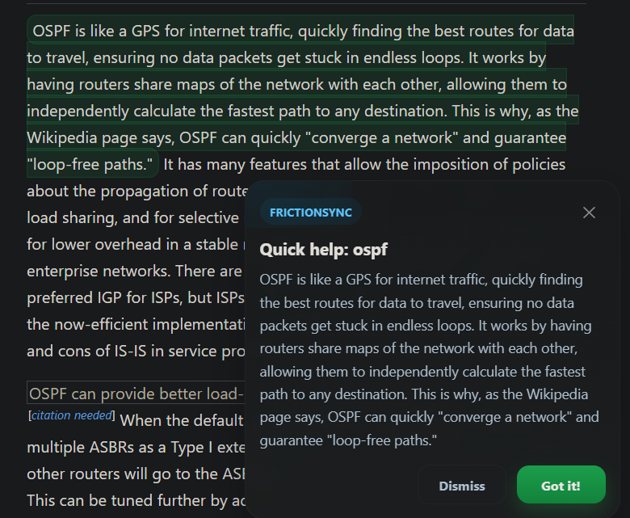
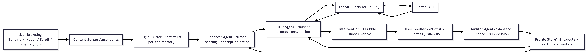

# FrictionSync

**FrictionSync** is an AI-powered Chrome extension that detects when a user is struggling to understand something while browsing and intervenes with adaptive explanations.

Instead of waiting for the user to manually ask for help, FrictionSync watches lightweight behavioral signals such as hover hesitation, backscrolling, long dwell, dead clicks, and rage clicks, then uses an agent pipeline to decide **when to intervene**, **what concept to explain**, and **how to explain it** based on the user's mastery level and interests.

---

# Why FrictionSync?

Most educational AI tools are reactive.  
The user must stop reading and explicitly ask questions.

FrictionSync acts like a **learning copilot inside the browser**.

It can:

• detect confusion from browsing behavior  
• infer the concept the user is struggling with  
• explain it instantly  
• adapt explanations based on user mastery  

This creates a **proactive AI tutor** instead of a normal chatbot.

---

### Demo 






# Core Features

## Behavioral Friction Detection

FrictionSync detects learning friction using browsing signals:

- Hover hesitation
- Backscrolling
- Long dwell time
- Dead clicks
- Rage clicks

These signals help detect **when a user is likely confused**.

---

## Multi-Agent Architecture

The system uses three AI agents:

**Observer Agent**
- Detects friction
- Selects the concept needing explanation

**Tutor Agent**
- Generates explanations using Gemini
- Adapts explanation style based on mastery level

**Auditor Agent**
- Updates mastery based on feedback
- Prevents repeated explanations

---

## Adaptive Tutoring

Explanation style adapts automatically.

**Beginner**

Simple intuitive explanations

**Intermediate**

Mechanism + intuition

**Advanced**

Concise technical explanation

---

## Context-Grounded Explanations

The Tutor agent receives context from:

- Page title
- Nearby hover terms
- Sentence-level context from the page

Example:

```
Concept: OSPF
Sentence:
"OSPF gathers link state information from routers and constructs a topology map."
```

This ensures explanations are **relevant to what the user is currently reading**.

---

# System Architecture



### Architecture Flow

```
User Browsing Behaviour
        │
        ▼
Interaction Sensors
(hover / dwell / backscroll / clicks)
        │
        ▼
Signal Buffer
(short term memory per tab)
        │
        ▼
Observer Agent
(friction scoring)
        │
        ▼
Tutor Agent
(Gemini explanation generation)
        │
        ▼
Intervention UI
(bubble / ghost overlay)
        │
        ▼
User Feedback
        │
        ▼
Auditor Agent
(mastery update)
```

---

# Project Structure

```
FrictionSync
│
├── backend
│   ├── main.py
│   ├── requirements.txt
│
├── public
│   ├── icon16.png
│   ├── icon48.png
│   ├── icon128.png
│
├── src
│   │
│   ├── background
│   │   ├── agents
│   │   │   ├── auditor.ts
│   │   │   ├── observer.ts
│   │   │   ├── tutor.ts
│   │   │   └── tutorClient.ts
│   │   │
│   │   ├── store
│   │   │   ├── profileStore.ts
│   │   │   └── signalBuffer.ts
│   │   │
│   │   └── background.ts
│   │
│   ├── content
│   │   ├── ui
│   │   │   ├── bubble.ts
│   │   │   └── ghostOverlay.ts
│   │   │
│   │   ├── content.ts
│   │   └── sensor.ts
│   │
│   ├── options
│   │   ├── options.html
│   │   └── options.ts
│   │
│   ├── popup
│   │   ├── popup.html
│   │   └── popup.ts
│
└── manifest.ts
```

---

# Tech Stack

### Frontend

- TypeScript
- Vite
- Chrome Extension Manifest V3

### Backend

- FastAPI
- Python
- Gemini API

### AI Architecture

- Observer Agent
- Tutor Agent
- Auditor Agent

---

# Interaction Signals

## Hover Hesitation

If the user hovers on a word for ~1.2 seconds it becomes a candidate concept.

Example:

```
hover → ospf
hover time → 1450ms
```

---

## Backscroll

Repeated upward scrolling suggests the user is re-reading content.

---

## Long Dwell

Staying too long on a paragraph indicates possible confusion.

---

## Dead Click

Clicking on non-interactive content expecting interaction.

---

## Rage Click

Multiple clicks in the same area in a short time.

---

# Agent Pipeline

## Observer Agent

Analyzes signals and computes friction score.

Example:

```
hover: ospf
backscroll: yes
dwell: high

friction score = 0.82
concept = ospf
```

---

## Tutor Agent

Creates explanation prompt:

```
concept: ospf
mastery: beginner
page title: OSPF routing protocol
sentence context: 
"OSPF gathers link state information from routers..."
```

Gemini generates the explanation.

---

## Auditor Agent

Updates mastery.

Example:

```
User clicks "Got it"
mastery(OSPF) += 1
```

Future explanations become shorter and more technical.

---

# UI Components

## Tutor Bubble

Floating explanation popup.

Features:

- explanation
- Got it button
- dismiss button

---

## Ghost Overlay

Inline explanation injected directly into page text.

Example:

Original:

```
OSPF builds a topology map.
```

Overlay:

```
OSPF builds a topology map (a network map showing how routers connect).
```

---

# Setup Instructions

## Clone Repository

```
git clone https://github.com/yourusername/frictionsync.git
cd frictionsync
```

---

## Install Dependencies

```
npm install
```

---

## Build Extension

```
npm run build
```

This generates the **dist** folder.

---

## Load Extension

Open

```
chrome://extensions
```

Enable **Developer Mode**

Click **Load unpacked**

Select the **dist folder**

---

# Backend Setup

Move to backend folder

```
cd backend
```

Install dependencies

```
pip install -r requirements.txt
```

Create `.env`

```
GEMINI_API_KEY=your_api_key
```

Run backend

```
uvicorn main:app --reload --port 8003
```

---

# Example Use Case

User reading networking page about **OSPF**

Behavior:

- Hover hesitation on OSPF
- Backscroll
- Long dwell

FrictionSync detects confusion and generates explanation.

User presses **Got it**

Mastery increases.

Future explanations become more concise.

---

## Skills Demonstrated

- Agentic AI system design
- Retrieval-Augmented Generation (RAG)
- Vector search with FAISS
- LLM orchestration
- Chrome extension development
- Backend API design with FastAPI
- Full-stack deployment

# Future Improvements

- gaze tracking using MediaPipe
- confusion hotspot detection
- concept knowledge graph
- reinforcement learning for intervention timing
- deployed backend service
- improved UI animations

---

# Author

**Tarun S**  
B.E Computer Science  
Dayananda Sagar College of Engineering  

Focus Areas:

- Agentic AI
- Machine Learning
- Human-AI Interaction

---

# Resume Highlights

This project demonstrates:

- Agent-based AI architecture
- Browser behavior sensing
- Adaptive tutoring systems
- LLM grounding with real page context
- Chrome extension engineering
- FastAPI + Gemini integration
- User mastery modeling